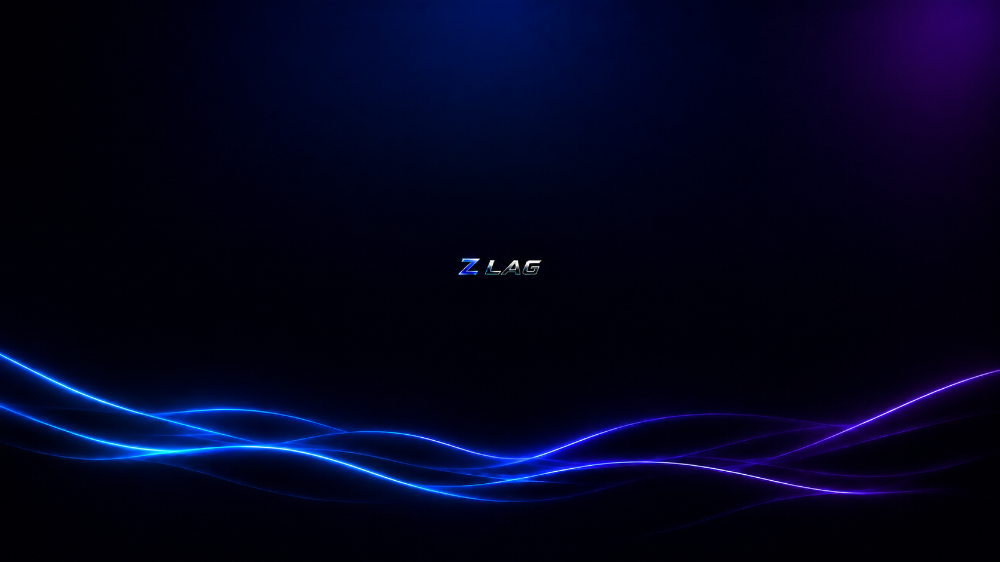

# Z LAG OS Playbook

Z LAG OS is an open-source, performance-driven configuration playbook designed for the AME Wizard deployment framework. Engineered specifically for competitive gaming, emulator optimization, and low-end hardware deployment, it systematically eliminates operating system bloat, minimizes kernel-level latency, and optimizes resource allocation without compromising system stability.

---

---

> ⚠️ **Disclaimer:** This playbook applies aggressive system-wide modifications, disables telemetry, and removes non-essential Windows components. It is strictly optimized for performance-critical environments.

---

## 🎯 Core Objectives

* **Latency Minimization:** Fine-tunes the Windows thread scheduler, Multimedia Class Scheduler Service (MMCSS), and I/O throughput to drastically reduce input delay.
* **Component De-bloating:** Removes telemetry modules, UWP background applications, Cortana, OneDrive, and intrusive logging services to maximize available CPU cycles.
* **Resource Efficiency:** Optimizes kernel memory allocation and background process management, ensuring minimal idle RAM usage.
* **Emulator & Gaming Optimization:** Implements custom priority mappings tailored for high-demand execution tasks, including heavy Android emulation layers (e.g., BlueStacks, MSI App Player).

---

## 🛠️ Architecture & Optimization Matrices

| Category | Optimization Mechanism | Operational Benefit |
| :--- | :--- | :--- |
| **Kernel & CPU** | Core Parking Disabled & Ultimate Power State Forced | Eliminates CPU downclocking and frequency scaling latency. |
| **Process Management**| Advanced Process Suspension Policy | Freezes redundant NT background subsystems during full-screen tasks. |
| **Graphics Pipeline** | Forced Hardware-Accelerated GPU Scheduling (HAGS) | Lowers frame-time variance and stabilizes 1% low FPS. |
| **Networking** | TCP/IP Stack & Nagle's Algorithm Tweaks | Reduces network jitter and mitigates packet-queuing delays. |

---

## 📋 Deployment & Installation

### Prerequisites
* A clean, un-tweaked installation of an official **Windows 10 or Windows 11** ISO (refer to our Releases page for supported build numbers).
* Active internet connection for the verification phase.
* The official deployment environment tool: **[AME Wizard](https://amelabs.net/)**.

### Step-by-Step Installation

1. Navigate to the **[Releases](../../releases)** section of this repository and download the latest `.apbx` playbook file.
2. Download and extract the latest version of the AME Wizard from the official website.
3. Temporarily disable **Windows Defender / Real-Time Protection** to allow the configuration scripts to execute successfully.
4. Launch `AME Wizard.exe` and drag the downloaded `Z_LAG_OS.apbx` file into the application interface.
5. Follow the cryptographic verification and configuration prompts within the wizard.
6. Allow the deployment phases to complete. The system will automatically execute a final restart to apply all kernel changes.

---

## ⚙️ Post-Deployment Recommendations

To maximize the efficacy of Z LAG OS, ensure the following hardware-level configurations are met:
1. **Disable HPET:** Disable High Precision Event Timer (HPET) via Windows Device Manager to optimize frame pacing.
2. **GPU Driver Configuration:** Set your NVIDIA or AMD control panel global power management mode to *Prefer Maximum Performance*.
3. **Peripheral Optimization:** Ensure your pointing device polling rate is locked to its highest native hardware capability (e.g., 1000Hz+).

---

## 🤝 Contributing

Contributions to further optimize system performance are highly encouraged. Please adhere to the following workflow:

1. Fork the repository.
2. Create a localized feature branch (`git checkout -b feature/OptimizationName`).
3. Commit your configuration modifications (`git commit -m 'Implement [Tweak Name] for latency reduction'`).
4. Push your changes to the branch (`git push origin feature/OptimizationName`).
5. Open a detailed Pull Request explaining the registry or script alterations.

---

## 📝 License

This project is licensed under the MIT License - see the [LICENSE](LICENSE) file for comprehensive details.
