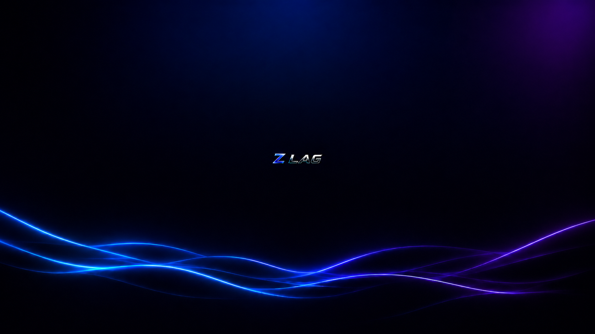

# Z LAG OS - Zero Lag Gaming Operating System

[](LICENSE)
[](https://www.microsoft.com/windows)
[](https://amelabs.net/)
[](https://github.com/MrPcGamerYT/Z-LAG-OS/releases)
[]()

> **Maximum FPS. Zero Lag. No Bloat.** A performance-driven AME Wizard playbook engineered for competitive gaming, Android emulators (BlueStacks / MSI App Player / LDPlayer), and low-end hardware.



---

### ⚠️ CRITICAL DISCLAIMER
This playbook applies **aggressive system-wide modifications**: disables telemetry, strips built-in apps, blocks updates, removes OneDrive (including local sync folders), Edge/WebView2, Cortana/Widgets, purges services, and modifies kernel power & scheduler policies. It is designed for **performance-critical gaming environments only**. Create a restore point and use on a **Local Offline Account**.

---

## 📚 Table of Contents
- [Core Objectives](#-core-objectives)
- [What's New in v5.12](#-whats-new-in-v512)
- [Optimization Matrix](#️-optimization-matrix)
- [Optional Performance Profiles](#-optional-performance-profiles)
- [Expected Performance Gains](#-expected-performance-gains)
- [What Is Removed vs Preserved](#-what-is-removed-vs-preserved)
- [Compatibility](#-compatibility)
- [FAQ](#-faq)
- [Contributing](#-contributing)
- [License & Credits](#-license--credits)

---

## 🎯 Core Objectives

| Goal | How We Achieve It |
| :--- | :--- |
| **Latency Minimization** | MMCSS system responsiveness tuning, GPU priority boosts, scheduler & I/O lock optimizations, a dedicated high-resolution timer service |
| **Debloat & Privacy** | Removes 60+ built-in apps, blocks 40+ telemetry hosts, disables diagnostics/telemetry tasks and tracking services |
| **RAM Efficiency** | Svchost consolidation, disables Superfetch/Search indexing, turns off visual effects, turns off prefetch, aggressively trims working sets (target idle RAM ~1.2–1.8 GB, ~40–55 background processes) |
| **Gaming & Emulator Boost** | High CPU priority for emulator processes, forces Hardware-Accelerated GPU Scheduling, bypasses fullscreen optimizations, honors GameDVR fullscreen-exclusive mode |
| **Network Latency** | Disables Nagle's algorithm, maximizes network throttling index, normal autotuning, DNS flush for reduced jitter and competitive ping |

---

## 🆕 What's New in v5.12

### v5.12 - complete WebView2/OneDrive removal, Z LAG tools and custom boot Welcome
- **WebView2 protection removed**: the repair/guarantee task and installer were
  deleted. The supplied ShadowWhisperer removal pass now downloads `setup.exe`
  only after its pinned SHA-256 is verified, force-uninstalls Edge/WebView2, and
  then `remove_edge.ps1` performs the authoritative all-user cleanup. Both
  products' AppX/provisioned packages, files, update clients, tasks, services
  and registry entries are removed and blocked from Edge Update. The
  process-floor passes no longer exempt WebView packages or processes.
- **Compatibility warning**: removing WebView2 can break applications that embed
  it, including some versions of Teams, Discord, Office add-ins and third-party
  launchers. This is intentional; reinstall WebView2 manually if one of your
  required applications does not bundle a fixed runtime.
- **OneDrive removal fixed for every user**: `remove_onedrive.ps1` runs every
  detected machine/per-user uninstaller, deprovisions the inbox package, mounts
  offline user hives, resets OneDrive known-folder redirection, removes startup
  entries/tasks/sync roots/Explorer namespaces/installers/caches, and prevents
  setup for future users. The playbook's fresh-install mode also removes local
  `OneDrive` and `OneDrive - *` sync folders.
- **Persistent service/process floor**: Windows trigger-start and per-user service
  instances can return after the first logon and push a lean boot from under 50
  toward 60+ processes. A brief non-resident SYSTEM task now re-locks the floor
  at boot, logon and every 15 minutes. It explicitly disables VSS/SwPrv, RPC
  Locator (not core RPC), SNMP Trap, Virtual Disk, WMP Network Sharing,
  ssh-agent, MSDTC, Windows Backup and their safe per-user/background peers.
  The expanded floor also covers unused RDP, WSL/Hyper-V guest integration,
  BranchCache/P2P, diagnostics, enterprise, printing, sensor and media services,
  and removes their trigger-start metadata. Core RPC, networking, audio, logon,
  security and AppX launch services remain hard-protected. Final counts still vary with hardware and third-party drivers.
- **Bluetooth Keep pairing repaired**: the low service floor no longer disables
  CDPSvc, CDPUserSvc or NcbService. A keep-mode repair restores the full radio,
  Add Device and per-user pairing chain, re-enables disabled Bluetooth PnP
  devices, and rechecks at boot/logon. Bluetooth Disable remains gated by its
  original option.
- **Z LAG TOOLBOX context menu**: the visible Classic Sound Start Menu folder,
  standalone submenu and old `00_ZLAG.Tools`/`00_ZLAG.TOOLBOX` keys are removed.
  A single first-position **Z LAG TOOLBOX** submenu with only clean spaced labels
  now provides **RAM Trim / Clean** first, **Temp Clean** second, then
  recycle-bin cleanup, DNS flush, Explorer restart, classic Sound Manager and
  the classic Volume Mixer. The compact classic flyout is still selected on
  Windows builds that honor `EnableMtcUvc`.
- **Native boot status + Welcome-only panel**: Windows' supported `VerboseStatus`
  policy keeps loading text on the real secure **Welcome / Please wait** screen.
  The old post-login process/app status list is removed. Once Explorer and the
  desktop are ready, a hidden launcher shows one short branded **Z LAG OS**
  Welcome panel with no boot, process, service, or startup-app status. Its footer
  uses a plain ASCII hyphen (`ZERO LAG - MAX PERFORMANCE`) to prevent garbled
  symbols under Windows PowerShell's legacy script encoding.
- **Task filenames now match execution order**: the task directory contains only
  the 37 active tasks, numbered consecutively from `01_powerPlan.yml` through
  `37_deepClean.yml` exactly as referenced by `main.yml`.

## 🆕 What's New in v5.11

### v5.11 - ULTRA process & RAM floor (VSS, notifications & discovery now off)
- **ULTRA idle floor**: `process_floor.ps1` now *disables* the on-demand features
  it used to keep "demand-only" — **System Restore (VSS), Windows notifications,
  network discovery, file sharing, hotspot/ICS, WebDAV, iSCSI and clipboard
  history** — so they can never spawn a process mid-game. Idle process & RAM
  counts drop further on both Windows 10 and Windows 11.
- **Background apps banned** (user-level `GlobalUserDisabled`) and the remaining
  telemetry/maintenance scheduled-task wakeups (CEIP, App Experience, Disk
  Diagnostic, WER queue, Location, SettingSync, Defrag, Diagnosis, Feedback)
  are disabled.
- **Still hard-protected**: Windows core (no boot break / no crash), Wi-Fi /
  Bluetooth / Ethernet and the AppX app-launch stack (Toolbox apps + Start Menu
  never silently crash). **Superseded in v5.12:** WebView2 is now removed. The boot/system-service guard (Start ≤ 1)
  is untouched.
- **Win11 ULTRA pass**: Win11-only `AarSvc`, `Ndu`, `WpnService` and `cbdhsvc`
  are now fully disabled instead of demand-only.
- **Safety restore point**: the playbook now creates a real restore point
  *before* any aggressive tweaks run (while VSS is still enabled), so you have
  a rollback target even though System Restore is disabled afterwards.
- **Production hardening**: the ULTRA floor scripts log to
  `C:\ProgramData\Z-LAG-OS\` (`process_floor.log` / `win11_process_floor.log`),
  self-check for elevation, and the broken Run-key cleanup + the logon banner
  (extra "OK" click) were removed.
- **Edge removal now actually works on the first run**: replaced the old batch
  (which could silently exit on its admin check and missed user shortcuts under
  the wrong profile) with a production PowerShell remover (`remove_edge.ps1`)
  following the proven `ShadowWhisperer/Remove-MS-Edge` technique — official
  `setup.exe --uninstall --system-level --force-uninstall`, AppX + provisioned
  package removal, services/tasks/registry cleanup, and shortcut + Start-tile
  removal from **every** user profile. The `Edge.lnk` leftovers are gone.
- **Historical v5.11 behavior (superseded):** WebView2 was previously repaired
  after Edge removal. v5.12 deliberately removes that protection and deletes the
  runtime instead.
- **First-run bloat removal fixed**: `appx_remover.ps1` now *deprovisions*
  inbox apps (they can no longer come back for new users) and no longer skips
  packages flagged `NonRemovable`, so all listed bloat is removed in a single
  apply. The previously-unwired per-interface TCP NoDelay script is now hooked
  into the network latency task.
- **User-facing tweaks now actually apply on first run**: every `HKCU`
  registry write (dark mode, small taskbar, start menu, mouse/keyboard,
  explorer, notifications, gaming config) and every Explorer restart now runs
  with `runas: currentUserElevated`, so settings land in the *logged-in user's*
  hive instead of the SYSTEM account's hive (which is why taskbar/dark-mode
  changes silently did nothing before). The floor scripts no longer restart
  Explorer under TrustedInstaller (that left the user without a desktop).

### v5.10 - Minimalist idle (~40–55 processes) + total MS removal + zero silent crashes + universal Win10/Win11
- **Universal Windows 10 + Windows 11**: version-aware taskbar and power plan
  scripts, correct Ultimate Performance GUID with High Performance fallback, and
  tolerant app/service removal so the same playbook works perfectly on both OSes.
- **Windows 11 extra floor**: a `builds: >=22000`-gated pass (`32_win11ProcessFloor.yml`
  + `win11_process_floor.ps1`) disables Win11-only services and AI components so
  Windows 11 lands nearly the same idle process count as Windows 10.
- **Idle Process + RAM Floor**: new `process_floor.ps1` engine consolidates every
  svchost pool, disables ~100 non-essential service families + startup entries,
  turns off prefetch/Superfetch and trims working sets, pushing **idle background
  processes down to ~40–55** and idle RAM to its floor.
- **Hard-protected by a keep-list**: Wi-Fi, Bluetooth, Ethernet, the AppX shell
  / app-launch stack are *never* touched, so networking keeps working and
  Toolbox-installed apps never silently crash. **WebView2 is no longer protected
  as of v5.12.**
- **Break-proofing**: boot/system-critical services are never disabled (a Start
  value ≤ 1 guard on top of the keep-list). *(Superseded in v5.11 ULTRA: the
  on-demand features — file sharing, hotspot/ICS, network discovery, System
  Restore (VSS), notifications, clipboard history — are now **fully disabled**
  for the absolute lowest idle footprint.)*
- **Fixed svchost threshold inconsistency** in `02_registry.yml` that was silently
  *increasing* the process count (now matches `final_push.ps1` = `380000000`).
- **Microsoft services are now removed *totally* when you pick that option**:
  Store + Xbox + MS account/cloud apps and services are uninstalled and disabled,
  and the AppX repair step now **respects your choice** instead of silently
  re-enabling `wlidsvc`/`TokenBroker`.
- **Apps installed via Z-LAG Toolbox can no longer crash silently**: the toolbox
  installer now logs everything, verifies the download SHA-256, smoke-tests the
  install, and pre-flights the packaged-app launch stack. Result is written to
  `C:\ProgramData\Z-LAG-OS\toolbox_install.log` + registry markers.

### v5.9 - Z-LAG Toolbox replaces Alt App Installer
- Playbook now installs the latest **[Z-LAG Toolbox](https://github.com/MrPcGamerYT/Z-LAG-TOOLBOX/releases)** (`Setup` silent `/S`).
- **Alt App Installer is no longer downloaded or installed.** Leftover Alt App folders/shortcuts are removed.
- Toolbox is installed on every apply (not only when Store is removed).

### v5.8 - Self-healing AppX services (no Store required)
- If the “service has not been started” error comes back after reboot, the OS now **fixes itself**.
- Boot + logon + repeating watchdog (`ZLAG-StartAppXRuntime`) keeps the Windows shell's AppX launch stack alive.
- Repair runs **last** in the playbook so later purges cannot leave those services disabled.

---

## 🛠️ Optimization Matrix

| Category | What Gets Tuned | Benefit |
| :--- | :--- | :--- |
| **Kernel & CPU** | Ultimate Performance power plan, core parking disabled, power throttling off | Eliminates downclocking and frequency-scaling lag |
| **Process Management** | Svchost consolidation plus a non-resident boot/logon/15-minute service-floor enforcer | Prevents trigger-start and per-user services from causing idle process creep |
| **Graphics Pipeline** | Forces HAGS, MSI mode on GPU, disables fullscreen optimizations | Stabilizes 1% lows, reduces frame-time variance |
| **Input & Timer** | Disabled dynamic tick, high-resolution timer, instant key/mouse response | Lower DPC latency, snappier input |
| **Networking** | Global + per-interface TCP no-delay, offload tuning, DNS flush | Reduced jitter, competitive ping |
| **Privacy & Telemetry** | Telemetry blocked at host + task level, update hosts blocked | Zero background upload |
| **UI/UX** | Transparency & animations off, forced dark theme, clean Start layout, first-position Z LAG TOOLBOX submenu, classic sound tools, native loading status and Welcome-only panel | Less RAM usage, clean labels and visible boot progress |

---

## ⚙️ Optional Performance Profiles

During AME Wizard setup you get radio pages so you control how aggressive the optimization is:

| Page | Default | Max Performance Option | Effect |
| :--- | :--- | :--- | :--- |
| **Browser** | Chrome | Brave / OperaGX / None | Choose a pre-installed browser; affects privacy posture |
| **Defender** | Keep (Recommended) | Disable | Frees ~150–300 MB RAM and removes scanning stutter. Advanced users only |
| **Bluetooth** | Keep | Disable | Removes Bluetooth drivers/services. Only if you use wired peripherals |
| **Wi-Fi** | Keep | Disable | Stops WLAN services. Only if you are on Ethernet |
| **MS Store & Services** | Keep (Recommended) | Remove | **Totally removes** Store + Xbox + MS account/cloud apps & services, saving 300–500 MB. Only the Windows shell's own AppX runtime is kept so apps still launch |

**Z-LAG Toolbox** is always installed from [GitHub Releases](https://github.com/MrPcGamerYT/Z-LAG-TOOLBOX/releases) as the official app/driver/tweak hub. Alt App Installer is not used. It installs Win32 (EXE/MSI) apps, so even with Microsoft services removed, downloaded apps launch instead of crashing.

---

## 📊 Expected Performance Gains

*Note: varies by hardware. Tested on i5-11400F + GTX 1660 + 16GB.*

| Metric | Stock Windows 11 | After Z LAG OS | Delta |
| :--- | :--- | :--- | :--- |
| **Idle RAM after boot** | 3.8–4.5 GB | 1.2–1.9 GB | -60% |
| **Processes** | 180–220 | ~40–55 (target as low as possible) | -70%+ |
| **Boot Time (SATA SSD)** | 22s | 12–14s | ~-40% |
| **DPC Latency (LatencyMon)** | 300–600µs spikes | 40–90µs avg | -80% |
| **FPS 1% lows (Valorant 1080p Low)** | 110 FPS | 165 FPS | +50% 1% low stability |
| **BlueStacks 5 startup** | 18s | 9s | 2x faster |
| **Disk Idle I/O** | 5–10 MB/s telemetry | <0.5 MB/s | ~-95% |

Optimization achieves: less background CPU, more CPU cycles to game threads via high MMCSS priority, and core parking disabled to prevent downclock spikes.

---

## 🧹 What Is Removed vs Preserved

### Removed / Disabled
- Built-in apps: People, Maps, Alarms, Camera, 3D Viewer, Sticky Notes, Mail, Calendar, Feedback, GetStarted, PowerAutomate, Clipchamp, Office Hub, Xbox layers (optional), YourPhone, and more
- Services: DiagTrack, dmwappush, WerSvc, SysMain, WSearch, VSS/SwPrv, RpcLocator, SNMPTRAP, vds, WMPNetworkSvc, ssh-agent, MSDTC, Windows Backup, MapsBroker, Xbox networking, RemoteRegistry, and many per-user service instances
- ULTRA (v5.11): System Restore/VSS, notifications, network discovery, file sharing, hotspot/ICS, WebDAV, iSCSI, clipboard history are now fully disabled for gaming (see the v5.11 notes before applying)
- Optional removals: Defender, Bluetooth stack, Wi-Fi stack, Store + MS identity/gaming services (all gated behind options)
- Telemetry: CEIP tasks, appraiser, 43 hosts-file entries, update-host blocking
- Features: OneDrive client/setup/sync integration and local sync folders, Widgets, Edge, WebView2 Runtime, Transparency, Animations, Search highlights, News/Feeds, Cortana hotkey

### Preserved (for stability)
- **WebView2 is not preserved in v5.12** - it is deliberately removed; apps that require it must supply or reinstall their own runtime
- **NVIDIA / AMD / Intel GPU driver packages** - never removed
- **Critical System apps**: desktop backbone and security-health UI
- **VC++ Runtimes 2015+** - installed fresh (x86 + x64 + ARM64 where applicable)
- **DirectX Jun2010** redist - installed for legacy games
- **.NET Framework** - left intact
- **Win32 core**: SFC, DISM, core audio, networking core (TCP/IP, DHCP, DNS cache kept)
- **Windows shell AppX runtime** (AppXSvc, StateRepository, LicenseManager, ClipSVC) - kept even with "Remove MS Services" so the Start Menu/Search and Toolbox-installed apps keep launching
- **WLAN / Bluetooth hardware** - kept by default; only removed if you opt in
- **Windows core / boot** - boot & system-critical services (Start ≤ 1) are never touched, so the OS boots cleanly on both Windows 10 and 11 even with ULTRA applied

---

## 💻 Compatibility (Universal Windows 10 + Windows 11)

The playbook is **version-universal**: every OS-sensitive step detects the running
build and applies the correct tweak, so the same `.apbx` works perfectly on both.

- **Windows 10**: 1809, 1903, 1909, 20H1, 20H2, 21H1, 21H2, 22H2
- **Windows 11**: 21H2 (22000), 22H2 (22621), 23H2 (22631), 24H2 (26100+)
- Architecture: x64 dominant, x86 limited, ARM64 (Surface) supported
- Languages: All display languages
- Framework: AME Wizard latest beta (0.7+)

**Version-aware highlights**
- **Taskbar** (`set_small_taskbar.ps1`): Win10 gets small icons + auto-hide + hidden
  search/task view/badges; Win11 gets left-aligned + small taskbar + hidden
  search/Copilot/task view/badges + auto-hide. No more Win10-only registry values
  being written onto Windows 11.
- **Power plan**: uses the real Ultimate Performance GUID and falls back to High
  Performance on editions where Ultimate is unavailable; tunes both AC and DC so
  laptops match desktops.
- **Windows 11 extra process floor** (`32_win11ProcessFloor.yml`, gated
  `builds: >=22000`): disables Win11-only services (AI/Copilot/Recall runtime,
  data-usage, notifications, per-user bloat), removes Win11-only apps, kills
  AI/Widgets processes and locks Copilot/Recall/Chat/Suggestions via policy — so
  Windows 11's idle count lands close to Windows 10's.
- **AppX / bloat removal**: all package/service removals are tolerant
  (`-ErrorAction SilentlyContinue`), so packages that only exist on one OS are
  simply skipped on the other.
- **Start menu, Edge/WebView2 removal, OneDrive removal, wallpaper, classic sound, boot Welcome and AppX repair**: all build-safe.

---

## ❓ FAQ

**Q: Is this a custom Windows ISO?**
A: No. It's a playbook (`.apbx`) that transforms a clean official Windows install via AME Wizard. No piracy.

**Q: Where did Alt App Installer go?**
A: Removed in v5.6. The playbook installs [Z-LAG Toolbox](https://github.com/MrPcGamerYT/Z-LAG-TOOLBOX/releases) instead.

**Q: Removed the Store and now Xbox Game Bar is gone?**
A: Expected. Use Z-LAG Toolbox to install apps, or keep the Store if you need Xbox services.

**Q: Why do apps installed by Z-LAG Toolbox never crash silently?**
A: The toolbox installer (1) downloads the latest release with retries, (2) verifies the file's SHA-256 digest, (3) smoke-tests the installed binary, and (4) pre-flights the packaged-app launch stack (LicenseManager, ClipSVC, AppXSvc, StateRepository) before it installs anything. Every result — success or failure — is written to `C:\ProgramData\Z-LAG-OS\toolbox_install.log` and registry markers, so nothing can fail silently. Since it installs Win32 apps, they run even with Microsoft services removed.

**Q: I removed the Store and still get "The service has not been started"?**
A: This is fixed in v5.10. The playbook keeps the *Windows shell's own* AppX runtime (License Manager, ClipSVC, AppXSvc, StateRepository) alive — those are part of Windows, not the Store — and the self-healing watchdog re-arms them on boot/logon. Microsoft account services (`wlidsvc`, `TokenBroker`) are left **demand-only** when you removed Microsoft services, so they add zero idle processes but can still answer if an app asks. To fix it manually, run `repair_appx_runtime.ps1` as Admin:

```
sc.exe config LicenseManager start= auto
sc.exe config ClipSVC start= auto
sc.exe config AppXSvc start= demand
sc.exe config StateRepository start= demand
net start LicenseManager
net start ClipSVC
```

Reboot and open the app. You still have no Microsoft Store.

**Q: I chose "Remove Microsoft Store & All MS Services" — is *everything* Microsoft gone?**
A: All Microsoft *apps* (Store, Xbox, YourPhone, Bing, Office Hub, etc.) are uninstalled and deprovisioned, and all Microsoft *account/cloud/identity/telemetry* services are disabled so they cannot run. Four tiny services (`AppXSvc`, `StateRepository`, `LicenseManager`, `ClipSVC`) are kept on purpose: they are the Windows desktop shell's own runtime (Start Menu/Search/app launching), not Store bloat — removing them is what used to make apps crash with "The service has not been started".

**Q: An app says WebView2 is missing after applying v5.12. Is that expected?**
A: Yes. v5.12 intentionally removes the WebView2 protection and runtime. Reinstall Microsoft's Evergreen WebView2 Runtime if that app does not ship its own fixed runtime.

**Q: What appears during and after boot?**
A: During secure Windows loading, native `VerboseStatus` text appears below Welcome/Please wait. After loading finishes and Explorer is ready, a short custom Z LAG OS Welcome panel appears by itself and closes automatically. It does not show process, service, app, or boot-status text after the desktop loads.

**Q: Where are the cleanup and classic sound tools?**
A: Right-click the desktop or a folder background and open **Z LAG TOOLBOX**. RAM Trim/Clean and Temp Clean are the first two options; classic Sound Manager and Volume Mixer are at the bottom. The old visible Start Menu folder, standalone Sound submenu and shortcut hotkey are intentionally removed.

**Q: Bluetooth Keep is selected but Add Device says "Couldn't connect"?**
A: This was caused by the aggressive floor disabling pairing dependencies even though the Bluetooth radio services were protected. The late keep-mode repair now restores `bthserv`, `BluetoothUserService`, `CDPSvc`, `CDPUserSvc`, `NcbService`, Device Association services and disabled Bluetooth PnP devices. If the repair log reports zero Bluetooth devices, install the OEM Bluetooth driver because that indicates a driver, BIOS or hardware issue.

**Q: Why did the process count rise again after the first boot?**
A: Windows can create suffixed per-user service instances at logon and trigger-start demand services later. `ZLAG-EnforceServiceFloor` now runs briefly as SYSTEM at boot, logon and every 15 minutes to stop those instances and restore `Start=4`. It is a scheduled recheck, not a resident background process. Hardware utilities and third-party drivers can still change the final count.

**Q: Will Windows Update break this?**
A: The hosts file blocks updates and the update service is disabled. If you later want updates, restore the hosts file first.

**Q: Is disabling Defender safe?**
A: Only if you understand the risks. Keep it enabled for daily use; disable only for tournament PCs behind a hardware firewall.

**Q: Can I use Wi-Fi removal on a laptop?**
A: No. Only pick Wi-Fi disable if you are on a desktop plugged in via Ethernet. Laptops should keep Wi-Fi.

**Q: FPS not improved?**
A: Make sure HPET is off, the Ultimate Performance power plan is active, Game Mode is off if using the MMCSS tweak, and your GPU driver is a clean install.

---

## 🛠️ Contributing

1. Fork repository
2. Create branch: `git checkout -b feature/MyTweak`
3. Commit: `git commit -m 'Add registry tweak: TCPNoDelay optimization'`
4. Push: `git push origin feature/MyTweak`
5. Open a Pull Request with registry paths + benchmark before/after

Please test on a VM (VMware Workstation with nested virtualization) before opening a PR.

---

## 📝 License

**Proprietary — Use Only. No Modification or Reuse.** See [LICENSE](LICENSE).

This project is **copyrighted** and is **not** open source or free software. The
license grants permission to use, run, install, and deploy an **unmodified** copy
for personal, educational, or commercial operation.

- ✅ You may use the unmodified Software for its intended purpose.
- ❌ You may not modify, adapt, patch, translate, or create derivative works.
- ❌ You may not reuse or extract its code, scripts, configurations, or assets in another project.
- ❌ You may not redistribute, sell, sublicense, lend, or publish the Software.
- ✅ Only technical installation/runtime copies and one backup copy are allowed.

Written permission from the copyright owner (**MR.PC GAMER / Z-LAG Community**)
is required for anything outside this limited use permission. All rights reserved.

---

## 🙏 Credits

- AME Wizard Team - Framework
- [Z-LAG Toolbox](https://github.com/MrPcGamerYT/Z-LAG-TOOLBOX) - Official app/driver/tweak hub
- AtlasOS & RevisionOS - Inspiration for advanced reg tweaks, adapted beyond
- MR.PC GAMER (MrPcGamerYT) - Maintainer, Z LAG Community
- ElegantDark cursor set - open source cursor designers

**Star ⭐ this repo if you get an FPS boost!**

---
*Z LAG OS v5.12 - Zero Lag, Max Performance. Built for gamers, by gamers.*
